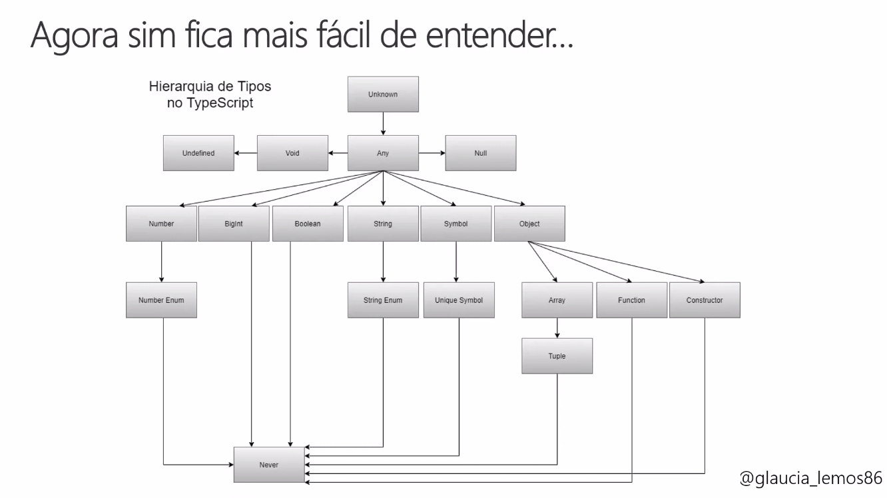

# TYPESCRIPT

## TypeScript é o futuro do JavaScript

- Permite usar o es6, es7, es8, es2020...
- Forte apoio a POO e FRP (functional reactive programming)
- Possui tipagem estática. O que torna mais fácil para o código
- Retorna os erros antes do tempo de execução. O que evita quebrar o código antes de ser executado.

## Criando arquivo tsconfig.json

- 

## TypeScript - Type Annotation

- Typescript é fortemente tipado, altamente recomendado sempre usar o type annotation

```bash
# Sintaxe
let nomeVariavel: TypeAnnotation = valor
```

## TypeScript - Hierarquia

- O typescript é uma linguagem que deve ser considerada até mesmo em aplicações mais complexas


