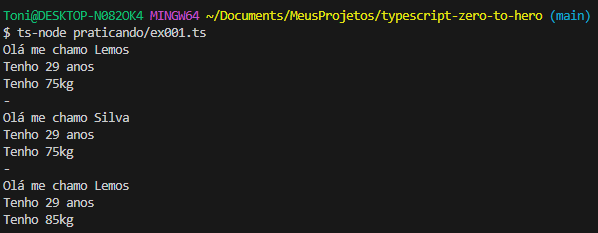

# Ex001 - exemplo de classe em typescript

- Ponto importante a Classe é como se fosse uma forma a partir do qual criamos algo
- O que sai da forma / Classe é o que chamamos de objeto e cada objeto é único por mais que tenha a mesma forma

```bash

class Pessoa {
    private nome: string
    private idade: number
    private peso: number

    constructor(nome: string, idade: number, peso: number){
        this.nome = nome
        this.idade = idade
        this.peso = peso
    }

    public seApresentar():string{
        return `Olá me chamo ${this.nome}`
    }

    public falarIdade():string{
        return `Tenho ${this.idade} anos`
    }

    public falarPeso():string{
        return `Tenho ${this.peso}kg`
    }

    public tomarDanone():void{
        this.peso += 10
    }
}

const pessoa01 = new Pessoa('Lemos', 29, 75)
const pessoa02 = new Pessoa('Silva', 29, 75)

console.log(pessoa01.seApresentar())
console.log(pessoa01.falarIdade())
console.log(pessoa01.falarPeso())
pessoa01.tomarDanone()

console.log('-')
console.log(pessoa02.seApresentar())
console.log(pessoa02.falarIdade())
console.log(pessoa02.falarPeso())

console.log('-')
console.log(pessoa01.seApresentar())
console.log(pessoa01.falarIdade())
console.log(pessoa01.falarPeso())


```

- Exemplo do retorno do código, misteriosamente a pessoa01 ao tomar danone ganhou 10kg


